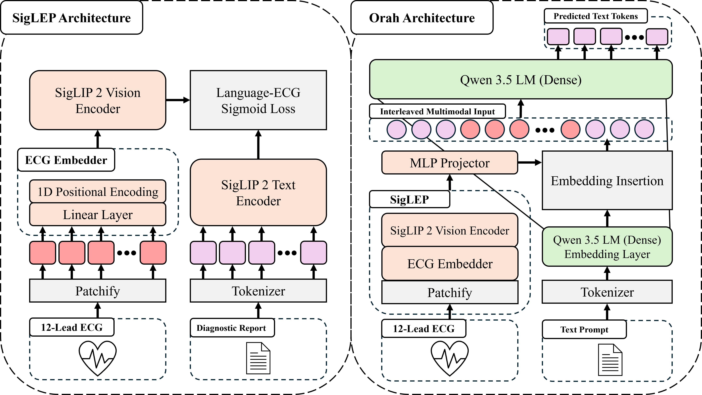
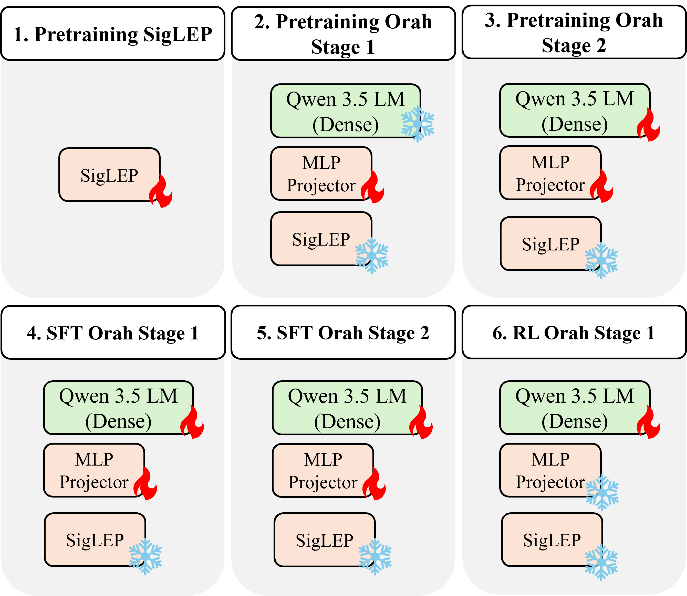

<h2 align="center">
  Scaling ECG-Language Model Reasoning to 13 Million Training Examples
</h2>

<div align="center">
  
</div>

## Overview <a name="overview"></a>
This is the full training, evaluation, and inferencing code for Orah, an ECG-Language Model scaled to 13 million training examples.
Prepare datasets with [ECG-Preprocess](https://github.com/ELM-Research/ECG-Preprocess) before use. Additionally, if you want to pretrain SigLEP, please view [ECG-Neural-Networks](https://github.com/ELM-Research/ECG-Neural-Networks).

We previously supported multiple ELM architectures, ECG representations, etc., however, we decided to completely dedicate this repository to training and evaluting Orah. We plan to iterate upon Orah. All updates will be made in this repository. 
Please feel free to contribute to the repository!
If there are any questions or bugs, please do not hesitate to reach out to wjhan{@}andrew{dot}cmu{edu} or submit an issue with corresponding details.

> **Status:** Beta.

## Setup <a name="setup"></a>
We use torch 2.9.1 with cuda 12.8 and primarily use H100 NVL NVIDIA GPUs.


```bash
git clone https://github.com/ELM-Research/ELM.git
cd ELM && uv sync
```

### Notes

1. To most optimally run Qwen3.5, it is recommended to install `causal-conv1d` and `flash-linear-attention`. We include it in the pyproject.toml file as a default install. However, if one has trouble installing it, please refer to their respective repos, or feel free to ignore the install. Ignoring will simply default Qwen3.5 to less optimized kernels.

## Training Details <a name="data"></a>

<table>
  <thead>
    <tr>
      <th>Stage</th>
      <th>Trainable Modules</th>
      <th align="right">Epochs</th>
      <th>Dataset</th>
      <th>Hugging Face Dataset</th>
      <th align="right">Samples</th>
    </tr>
  </thead>
  <tbody>
    <tr>
      <td rowspan="2">SigLEP Pretraining</td>
      <td rowspan="2">Encoder</td>
      <td rowspan="2" align="right">30</td>
      <td><a href="https://bdsp.io/content/heedb/">Harvard-Emory ECG Database (HEEDB)</a></td>
      <td></td>
      <td align="right">1,927,353</td>
    </tr>
    <tr>
      <td><strong>Total</strong></td>
      <td></td>
      <td align="right"><strong>1,927,353</strong></td>
    </tr>
    <tr>
      <td rowspan="5">Orah Pretraining 1</td>
      <td rowspan="5">Connector</td>
      <td rowspan="5" align="right">3</td>
      <td><a href="https://physionet.org/content/echonext/1.1.1/">EchoNext</a></td>
      <td></td>
      <td align="right">24,763</td>
    </tr>
    <tr>
      <td><a href="https://bdsp.io/content/heedb/">Harvard-Emory ECG Database (HEEDB)</a></td>
      <td></td>
      <td align="right">642,451</td>
    </tr>
    <tr>
      <td>Internal Dataset 1</td>
      <td> <span style="color:red"><strong>Not Available</strong></span></td>
      <td align="right">149,929</td>
    </tr>
    <tr>
      <td>Internal Dataset 2</td>
      <td><span style="color:red"><strong>Not Available</strong></span></td>
      <td align="right">65,445</td>
    </tr>
    <tr>
      <td><strong>Total</strong></td>
      <td></td>
      <td align="right"><strong>882,588</strong></td>
    </tr>
    <tr>
      <td rowspan="6">Orah Pretraining 2</td>
      <td rowspan="6">Connector, LLM</td>
      <td rowspan="6" align="right">1</td>
      <td><a href="https://physionet.org/content/echonext/1.1.1/">EchoNext</a></td>
      <td></td>
      <td align="right">57,780</td>
    </tr>
    <tr>
      <td><a href="https://bdsp.io/content/heedb/">Harvard-Emory ECG Database (HEEDB)</a></td>
      <td></td>
      <td align="right">5,996,208</td>
    </tr>
    <tr>
      <td>Internal Dataset 1</td>
      <td><span style="color:red"><strong>Not Available</strong></span></td>
      <td align="right">349,835</td>
    </tr>
    <tr>
      <td>Internal Dataset 2</td>
      <td><span style="color:red"><strong>Not Available</strong></span></td>
      <td align="right">152,706</td>
    </tr>
    <tr>
      <td>Internal Dataset 3</td>
      <td><span style="color:red"><strong>Not Available</strong></span></td>
      <td align="right">11,460</td>
    </tr>
    <tr>
      <td><strong>Total</strong></td>
      <td></td>
      <td align="right"><strong>6,567,989</strong></td>
    </tr>
    <tr>
      <td rowspan="5">Orah SFT 1</td>
      <td rowspan="5">Connector, LLM</td>
      <td rowspan="5" align="right">3</td>
      <td><a href="https://github.com/Jwoo5/ecg-qa">ECG-QA MIMIC-IV</a></td>
      <td></td>
      <td align="right">352,382</td>
    </tr>
    <tr>
      <td><a href="https://github.com/YubaoZhao/ECG-Chat">Pretrain MIMIC</a></td>
      <td></td>
      <td align="right">502,687</td>
    </tr>
    <tr>
      <td><a href="https://github.com/YubaoZhao/ECG-Chat">ECG-Instruct 45K</a></td>
      <td></td>
      <td align="right">44,778</td>
    </tr>
    <tr>
      <td><a href="https://github.com/lanxiang1017/GEM">ECG-Grounding</a></td>
      <td></td>
      <td align="right">353,210</td>
    </tr>
    <tr>
      <td><strong>Total</strong></td>
      <td></td>
      <td align="right"><strong>1,253,057</strong></td>
    </tr>
    <tr>
      <td rowspan="6">Orah SFT 2</td>
      <td rowspan="6">Connector, LLM</td>
      <td rowspan="6" align="right">3</td>
      <td><a href="https://github.com/Jwoo5/ecg-qa">ECG-QA MIMIC-IV</a></td>
      <td></td>
      <td align="right">822,226</td>
    </tr>
    <tr>
      <td><a href="https://github.com/lanxiang1017/GEM">ECG-Grounding</a></td>
      <td></td>
      <td align="right">824,158</td>
    </tr>
    <tr>
      <td><a href="https://github.com/PKUDigitalHealth/ECG-R1">ECG-Instruct ECG-R1</a></td>
      <td></td>
      <td align="right">1,147,368</td>
    </tr>
    <tr>
      <td><a href="https://github.com/PKUDigitalHealth/ECG-R1">ECG Protocol-Guided Grounding CoT</a></td>
      <td></td>
      <td align="right">30,000</td>
    </tr>
    <tr>
      <td><a href="https://github.com/OpenTSLM/OpenTSLM/tree/main">ECG-QA-CoT</a></td>
      <td></td>
      <td align="right">159,313</td>
    </tr>
    <tr>
      <td><strong>Total</strong></td>
      <td></td>
      <td align="right"><strong>2,983,065</strong></td>
    </tr>
    <tr>
      <td rowspan="2">Orah RL</td>
      <td rowspan="2">Connector, LLM</td>
      <td rowspan="2" align="right">3</td>
      <td><a href="https://github.com/PKUDigitalHealth/ECG-R1">RL ECG-R1</a></td>
      <td></td>
      <td align="right">3,948</td>
    </tr>
    <tr>
      <td><strong>Total</strong></td>
      <td></td>
      <td align="right"><strong>3,948</strong></td>
    </tr>
    <tr>
      <td colspan="5" align="right"><strong>Grand Total</strong></td>
      <td align="right"><strong>13,618,000</strong></td>
    </tr>
  </tbody>
</table>

### Datasets
First, preprocess the ECGs using the [ECG-Preprocess](https://github.com/ELM-Research/ECG-Preprocess) repository.
We provide the instructions to preprocess all datasets besides the internal datasets.
We note that the user simply has to preprocess the **HEEDB, EchoNext, PTB-XL, and MIMIC-IV-ECG Base datasets**.
We provide preprocessed HuggingFace datasets that contains the text and ECG path and use these during training.

### Training Stages

<div align="center">
  
</div>

## Contributions <a name="contributions"></a>

We welcome contributions to the repository! Please feel free to open an issue or pull request for any bugs or features you would like to add. We are always looking for new ECG datasets to benchmark our methods on. If you have any recommendations, please let us know!

For most processes, we have a `--dev` flag to run in a smaller scale and add some verbosity for debugging. Feel free to add this flag when needed!

## Acknowledgements <a name="ack"></a>
This work is done in collaboration with the Mario Lemieux Center for Heart Rhythm Care at Allegheny General Hospital.

We thank Chaojing Duan, Michael A. Rosenberg, Emerson Liu, Ding Zhao, Hyoeun Kang, Wenhao Ding, Haohong Lin, Shiqi Liu, Xiaoyu (Simon) Song, Tony Chen, Atharva Mhaskar, Zhepeng Cen, Yihang Yao, and Dylan Leong for their helpful discussions, feedbacks, and support in developing the initial [ECG-Bench](https://github.com/willxxy/ECG-Bench) which turned into the current ELM repository.

We thank the authors of [ECG-Byte](https://github.com/willxxy/ECG-Byte), [MERL](https://github.com/cheliu-computation/MERL-ICML2024), [ST-MEM](https://github.com/bakqui/ST-MEM), [ECG-QA](https://github.com/Jwoo5/ecg-qa), [ECG-Chat](https://github.com/YubaoZhao/ECG-Chat), [PULSE](https://github.com/AIMedLab/PULSE), [GEM](https://github.com/lanxiang1017/GEM), [ECG-R1](https://github.com/PKUDigitalHealth/ECG-R1) for their code and publicly released datasets.

We also thank Fabien Sanglard for their [AGENTS.md file](https://fabiensanglard.net/agent.md/index.html).

Lastly, we thank [HuggingFace](https://huggingface.co/) for providing the APIs for the models.

## License

MIT, except all third-party libraries, models, and datasets used in the repository. Please refer to the third-party library, model and dataset's corresponding licenses.
